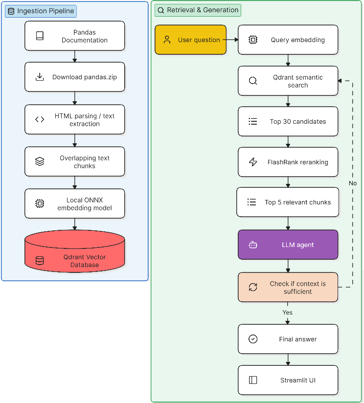
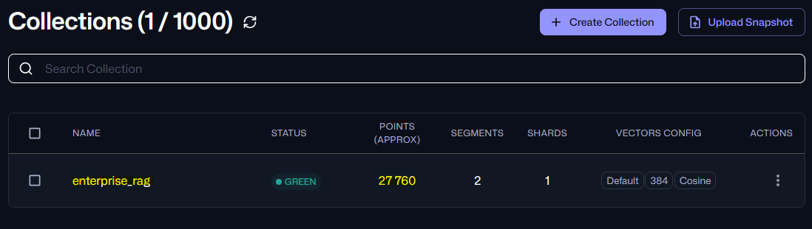
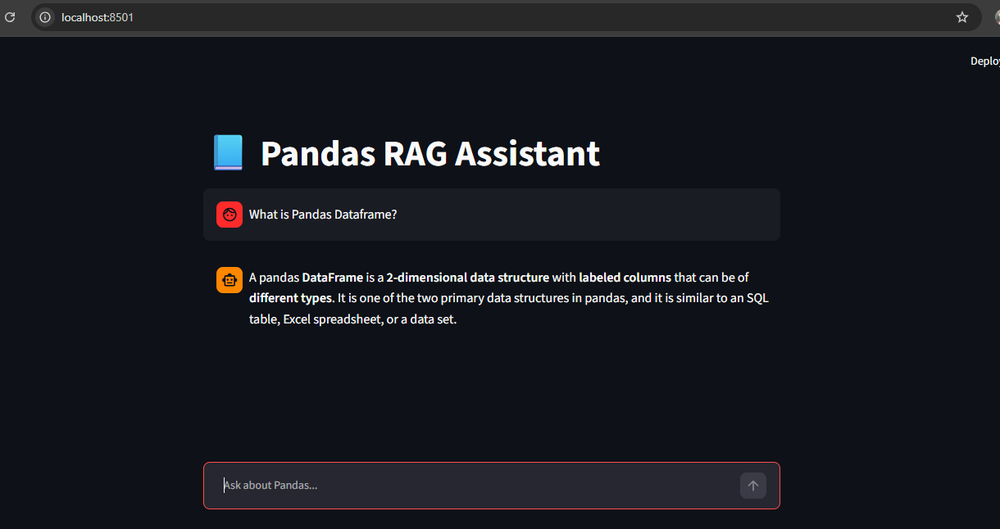

# Pandas RAG Assistant

A Retrieval-Augmented Generation (RAG) application that answers questions using the **Pandas documentation** as its knowledge base.


## 1. Problem Description

Pandas has extensive documentation covering APIs, DataFrames, indexing, grouping, joins, missing values, transformations, plotting, and many other topics. Finding the exact piece of information needed to answer a technical question can be time-consuming.

The **Pandas RAG Assistant** solves this problem by indexing the official Pandas documentation in a vector database and using semantic retrieval to find relevant documentation before generating an answer.

The assistant is designed to:

-- Answer questions from the Pandas documentation.
-- Retrieve semantically relevant documentation rather than relying only on exact keyword matching.
-- Rerank retrieved documents to improve relevance.
-- Allow the LLM to perform multiple searches when the first retrieval is insufficient.
-- Avoid answering from unsupported knowledge when the documentation does not contain the answer.
-- Provide a simple conversational Streamlit interface.

The project demonstrates a complete RAG workflow:



## 2. Project Goals

The project demonstrates the major components expected in an LLM/RAG project:

| Component | Implementation |
|---|---|
| Knowledge base | Official Pandas documentation |
| Document ingestion | Python + BeautifulSoup |
| Chunking | Sliding-window chunking with overlap |
| Embeddings | `Xenova/all-MiniLM-L6-v2` ONNX model |
| Vector database | Qdrant |
| Vector similarity | Cosine similarity |
| Retrieval | Qdrant semantic search |
| Reranking | FlashRank / TinyBERT |
| LLM | OpenAI Responses API |
| Agentic retrieval | LLM function/tool calling |
| Interface | Streamlit |
| Evaluation opportunity | Compare retrieval strategies and LLM prompts |

## 3. Prerequisites

* Python 3.11.15 is used for this project.
* Register [qdrant cloud DB](https://login.cloud.qdrant.io/u/login/identifier?state=hKFo2SBwT2dKck0tdG5FWkNSbzNhWVhhWk5rWG5UVHV5bjZkYqFur3VuaXZlcnNhbC1sb2dpbqN0aWTZIE54aXJxNjBzU0RmSkNUU3h3SEVjT2RIMjZCWE1qeTkto2NpZNkgckkxd2NPUEhPTWRlSHVUeDR4MWtGMEtGZFE3d25lemc)
* During the setup, Qdrant will generate an API Key. Copy and save it securely, as it will not be displayed again.
* Once logged in then navigate to the Clusters section and click Create a Free Cluster. Give your cluster a name, select a cloud provider, and choose a region closest to your users.
* Once cluster is visible and healthy then click on the cluster name and copy the Endpoint
* Update [.env](.env) as mentioned below:
  - if you are using OPENAI for LLM then update `OPENAI_API_KEY` variable
  - copied qdrant API key in `QDRANT_API_KEY` variable
  - Endpoint should be updated in `QDRANT_CLUSTER_ENDPOINT` variable

## 4. Project Structure

Recommended project structure:

```text
Pandas_RAG_Assistant/
│
├── data/
│   ├── pandas.zip
│   └── pandas_docs/
│
├── src/
|   ├── models/
|   │   └── Xenova/
|   │       └── all-MiniLM-L6-v2/
|   │           ├── tokenizer.json
|   │           └── model.onnx
|   ├── download.py
|   ├── embedder.py
|   ├── ingest.py
|   ├── vector_db.py
|   ├── reranker.py
|   ├── rag.py
|   └── uiapp.py
|
├── pyproject.toml
├── .env
└── README.md
```


## 5. Running the Project

For ONNX Runtime and related ML packages, Python 3.11 is a safer choice than very new Python releases if package compatibility becomes an issue. currently project ran on Python 3.11.15.

### Step 1 — Install dependencies using uv

```bash
git clone <path>
cd Pandas_RAG_Assistant
uv sync
```

### Step 2 — Configure environment variables

Provide all the values in the .env file for OpenAI and Qdrant credentials.

### Step 3 — Download embedding model

```bash
cd src
python download.py
```

Expected in `src` directory:

```text
models/
└── Xenova/
    └── all-MiniLM-L6-v2/
        ├── tokenizer.json
        └── model.onnx
```

### Step 4 — Ingest Pandas documentation

Download Pandas Documentation and insert data in Qdrant Database.

Run:

```bash
python ingest.py
```

This will:

```text
Download Pandas documentation
        ↓
Extract HTML
        ↓
Clean HTML
        ↓
Create chunks
        ↓
Generate embeddings
        ↓
Create Qdrant collection
        ↓
Upload vectors
```

> [!NOTE]
> Ingestion process will take 35 to 40 minutes due to pandas documentation is more than 200 MB.

Once, ingestion process is completed successfully, go to Qdrant cloud cluster tab and click on `Open Cluster UI` on cluster grid. You will be able to see enterprise_rag as collection name and as ingestion points has been inserted in the db which is highlighted in yellow color.



### Step 5 — Start Streamlit

```bash
streamlit run uiapp.py
```

Then open the local Streamlit URL displayed by the command.

UI will be displayed as per below (URL wll take sometime to load and it will be empty):




## 6. Example Questions

The following questions were tested

```text
- What is a pandas DataFrame?
- How can I read a CSV file using pandas?
- How do I select a column from a DataFrame?
- How can I group a DataFrame by multiple columns?
- What is the difference between loc and iloc?
- How can I handle missing values in pandas?
- How can I perform a groupby aggregation and return multiple statistics for different columns?
- What is the recommended way to combine DataFrames when the join keys have different names?
- How can I reshape a DataFrame using pivot_table while handling duplicate combinations of index and columns?
```

### Out-of-scope test

A useful RAG evaluation question is:

```text
How do I create a Kubernetes deployment for a FastAPI application?
```

The assistant should not invent a Pandas answer. It should indicate that the Pandas documentation does not contain the requested information.

## 7. Project Detail Information

### 7.1 `download.py` -- To Download the model from Hugging Face

Downloads the ONNX embedding model from Hugging Face.

The implementation searches the repository for one of the supported ONNX model locations:

```python
ONNX_CANDIDATES = [
    "onnx/model.onnx",
    "onnx/encoder_model.onnx",
    "model.onnx",
]
```

It downloads:

- `tokenizer.json`
-  `ONNX model (model.onnx)`

The files are stored locally under:

```text
models/Xenova/all-MiniLM-L6-v2/
```

This avoids downloading the model every time the application starts.

### 7.2 `embedder.py` -- To embed data and query

The `Embedder` class performs local text embedding using:

- Hugging Face `tokenizers`
- ONNX Runtime
- `all-MiniLM-L6-v2`

The model produces **384-dimensional embeddings**.

The process is:

```text
Text
  │
  ▼
Tokenizer
  │
  ▼
input_ids
attention_mask
token_type_ids
  │
  ▼
ONNX Runtime
  │
  ▼
Token embeddings
  │
  ▼
Mean pooling using attention mask
  │
  ▼
L2 normalization
  │
  ▼
384-dimensional vector
```

Normalization is important because the Qdrant collection uses cosine similarity.

Example:

```python
embedder = Embedder()

vector = embedder.encode(
    "How do I group a DataFrame?"
)
```

For multiple texts:

```python
vectors = embedder.encode_batch([
    "What is a pandas DataFrame?",
    "How does groupby work?",
])
```

### 7.3 `ingest.py` -- To ingest pandas documentation in qdrant DB

This module performs document ingestion.

#### Step 1 — Download Pandas documentation

The ingestion process downloads:

```text
https://pandas.pydata.org/docs/pandas.zip
```

and extracts it into:

```text
data/pandas_docs/
```

#### Step 2 — Clean HTML

Each HTML document is parsed with BeautifulSoup.

Script and style elements are removed:

```python
for script in soup(["script", "style"]):
    script.decompose()
```

Then visible text is extracted:

```python
text = soup.get_text(
    separator=" ",
    strip=True
)
```

Very small documents are ignored.

#### Step 3 — Chunk documents

Documents are split into overlapping chunks using a sliding window.

Current configuration:

```python
size=2000
step=600
```

Here, `size` is the chunk length and `step` represents the overlap.

overlap helps preserve context between neighboring chunks.

### 7.4 `vector_db.py` -- Search and Insert function for Qdrant DB

This module connects the application to Qdrant.

The collection is:

```text
enterprise_rag
```

with:

```text
Vector dimension: 384
Distance: cosine
```

The ingestion process:

```text
Chunk
  │
  ▼
Embedding model
  │
  ▼
384-dimensional vector
  │
  ▼
Qdrant Point
```

Each point contains:

```json
{
  "id": 1,
  "vector": [ ... ],
  "payload": {
    "text": "...",
    "source": "..."
  }
}
```

#### Batch processing

Documents are embedded in batches:

```python
BATCH_SIZE = 200
```

Qdrant uploads are performed concurrently:

```python
MAX_WORKERS = 4
```

This improves ingestion performance because multiple upload batches can be sent to Qdrant concurrently.

The important distinction is that **embedding generation is currently batch-based but not parallelized**, while **Qdrant uploads are parallelized**.

### 7.5 Semantic Search

When a user asks a question:

```text
User query
    │
    ▼
Embedding model
    │
    ▼
384-dimensional query vector
    │
    ▼
Qdrant cosine similarity
    │
    ▼
Top 30 candidates
```

The current search configuration is:

```python
def search(query, limit=30):
```

The first-stage retrieval therefore returns up to 30 candidates.

### 7.6 `reranker.py` -- reranking the document

Vector similarity is useful for finding semantically similar text, but the top results are not always the best results for the exact query.

The project therefore uses a second-stage reranker:

```text
Qdrant
Top 30
  │
  ▼
FlashRank
  │
  ▼
Top 5
```

The configured reranker is:

```python
Ranker(
    model_name="ms-marco-TinyBERT-L-2-v2"
)
```

The reranker receives:

```text
query + candidate passage
```

and assigns a relevance score.

This is different from the embedding model:

### Embedding model

Used for:

```text
query → vector
document → vector
```

Purpose:

```text
Fast candidate retrieval
```

### Reranker

Used for:

```text
query + document → relevance score
```

Purpose:

```text
More accurate ordering of retrieved candidates
```

Using separate models for retrieval and reranking is a standard two-stage retrieval architecture.


## 8. `rag.py` — Agentic RAG

The RAG layer uses the OpenAI Responses API with a function tool.

The LLM receives a search tool:

```text
search(query)
```

The tool searches the Pandas documentation stored in Qdrant.

The system instructions tell the assistant to:

1. Search the vector database.
2. Check whether the retrieved context is sufficient.
3. Reformulate the query when necessary.
4. Perform additional searches when appropriate.
5. Never invent unsupported information.
6. State that the documentation does not contain the answer when sufficient evidence cannot be found.

This creates an **agentic RAG loop**.

### Agentic flow

```text
User Question
      │
      ▼
     LLM
      │
      ├── Need information?
      │
      ▼
search(query)
      │
      ▼
Qdrant + reranker
      │
      ▼
Retrieved context
      │
      ▼
LLM evaluates context
      │
      ├── Sufficient ───────► Final answer
      │
      └── Insufficient
              │
              ▼
        Reformulate query
              │
              ▼
           Search again
```

The current implementation limits the loop to:

```python
MAX_ITERATIONS = 3
```

This prevents an uncontrolled number of tool calls.

## 9. `uiapp.py` — Streamlit Interface

The application provides a conversational UI using Streamlit.

The UI provides:

- Chat history
- User message display
- Assistant response display
- Search/loading spinner
- Chat input

## 10. Retrieval Approaches for Evaluation

### Approach 1 — Vector Search

First only used the Vector Search with using multiple different context with top5, top10 and top20 results.

```text
Query
  ↓
Embedding
  ↓
Qdrant
  ↓
Top K
```

But, 50% of the time was not getting relevant answer. So, decided to try Approach 2 with reranking.

### Approach 2 — Vector Search + Reranker

For reranking used flasshrank and model as `ms-marco-TinyBERT-L-2-v2`.

Following evolution steps has been performed.
- Top50 results from vector search and then reranking of Top5 results. But, delay was more getting an answer
- Top20 results from vector search accuracy was around 80% but, faster
- Finally Top30 results from vector search was giving better result from Top20 and faster than Top50 results.

```text
Query
  ↓
Embedding
  ↓
Qdrant Top 30
  ↓
FlashRank
  ↓
Top 5
```

Advantages:

- Better relevance ordering.
- Reduces irrelevant context sent to the LLM.

## 11. LLM Evaluation

LLM evaluation is performed following ways

### 11.1 Trying diffrent instruction for getting better reponse

Evaluating different instructions to improve response quality.

#### Instruction 1

```text
You are a Pandas documentation assistant.

Answer the user's question using only the retrieved documentation.

If the answer is available in the documentation, provide a clear
and concise explanation.
```

#### Instruction 2

currently used Instruction for LLM response

```text
You are a Pandas documentation assistant.

Always answer only from the retrieved documentation.

For every user question:

1. Search the vector database.
2. If the retrieved context is insufficient,
   reformulate the query and search again.
3. You may perform multiple searches.
4. Never invent information.
5. If the answer is not found after several searches,
   reply that the documentation does not contain the answer.
```

### 11.2 Strict RAG vs Agentic RAG
Two retrieval strategies were compared:

1. Strict RAG — one retrieval step followed by a grounded LLM response.
2. Agentic RAG — the LLM can reformulate the query and perform additional
   searches when the retrieved context is insufficient.

Strict RAG produced less relevant answers for some medium- and high-difficulty questions. So, Agentic RAG was implemented for maximum 3 iteration for getting correct answer.